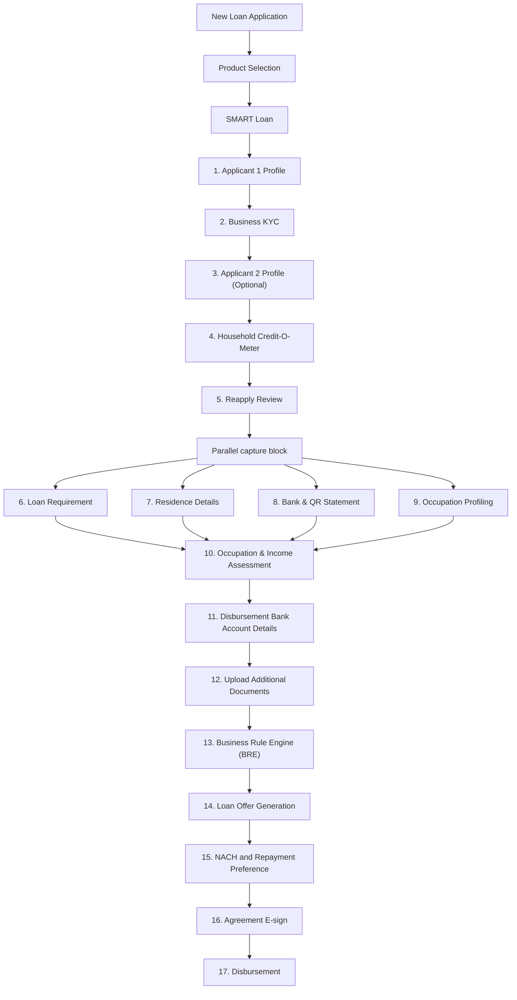

# New Loan Application - SMART Loan

Canonical for product intent, screen order, user-facing behavior, business rules, acceptance criteria, and open questions for the SMART Loan new application flow.

Owner: Arnav  
Status: draft  
Last updated: 2026-06-29

## Source Links

| Source | Link/path | Notes |
| --- | --- | --- |
| SMART Loan phase 1 attachment | User-provided attachment | Primary source for SMART Loan mobile/CRM changes, test cases, open points, observations. |
| Rough app documentation | Google Doc: https://docs.google.com/document/d/1RjWx3gUFbFS1ZXHuyM2ElMg1ltK7SCu__IaIKMfZocM/edit?usp=sharing | Priority source when there is contradiction. |
| SMART Loan product construct | `smart-loan-product-construct.md` | Product overview, customer segment, pricing, repayment, documentation. |
| Product variants doc | `xpress-flow-product-variants.md` | Cross-product differences. |
| Flow doc | `../flows/new-loan-application-smart-loan.md` | End-to-end sequencing and handoffs. |
| Insurance Nominee Details screenshot | User-provided screenshot, 2026-06-16 | Confirms nominee form before InPrime Loan Offer screen when there is no co-borrower. |

## Source Priority Rule

If this doc conflicts with another source, follow the rough documentation / SMART Loan rough flow first, then mark the contradiction in open questions or mismatches.

## Scope

This document covers only the **SMART Loan** path inside **New Loan Application**.

Out of scope:

- Super/Welcome Loan.
- Micro LAP / MLAP.
- Top-Up Loan.
- Repeat Loan.
- Detailed API implementation.
- Provider-specific truth.
- CRM implementation detail beyond product-visible behavior.

## Summary

SMART Loan is a live business loan flow in the current staff app for small businesses in urban geographies. Unlike Super/Welcome, SMART Loan has only one mandatory applicant. Applicant 2 is optional, Applicant 3 is not part of the flow, and Business KYC is introduced as a major product-specific stage.

The current draft visible app order contains 17 steps.

## Business Objective

- Enable staff to originate SMART Loan applications for eligible business customers.
- Support single-applicant flow while allowing optional co-applicant.
- Complete identity KYC and Prime Test before Business KYC.
- Capture business KYC before credit/bureau progression.
- Capture business-income signals from bank and QR statements.
- Keep loan requirement restricted to Business Loan.
- Support SMART-specific BRE, income assessment, nominee prerequisite, repayment registration, e-sign, and disbursement.

## Users And Roles

| Role | Product role in SMART Loan flow | Open questions |
| --- | --- | --- |
| RO / Staff user | Starts SMART Loan application and completes work till Occupation Profiling; after offer generation, contacts customer and completes NACH/e-sign/send-for-disbursement steps. | Confirm any SMART-specific exception. |
| Applicant 1 / Primary borrower | Mandatory applicant and legal/business owner context. | Required for all SMART Loan applications. |
| Applicant 2 / Co-applicant | Optional applicant; can be skipped. | AM/PD can request Applicant 2. |
| AM / PD | Owns Occupation & Income Assessment through BRE and may request Applicant 2. | Exact API/status mapping belongs in tech docs. |
| Credit team | Reviews SMART-specific BRE and generates/approves the offer. | Confirm review queue and ownership in tech docs. |
| Operations / Opex | Handles final disbursement where applicable. | Confirm SMART Loan disbursement ownership. |

## Visual Journey

## Screen Inventory

| Step | Screen / module | Product purpose | SMART Loan behavior |
| --- | --- | --- | --- |
| 1 | Applicant 1 Profile | Capture mandatory primary borrower profile. | Language/mobile, area serviceability, identity KYC, and Prime Test. Any 2 identity KYC documents are needed from Aadhaar, PAN, Driving Licence, and Voter ID. PAN or Form 60 is required. |
| 2 | Business KYC | Capture and verify business identity. | Comes after identity KYC and Prime Test. Any one of GST, Shop & Establishment, Udyam, or Other Business KYC is mandatory for credit bureau check. |
| 3 | Applicant 2 Profile (Optional) | Capture optional co-applicant. | Skip feature required; Applicant 1 flow replicated; AM/PD can request Applicant 2. |
| 4 | Household Credit-O-Meter | Show applicant/household credit view. | Same as existing, must work whether Applicant 2 is added or skipped. |
| 5 | Reapply Review | Review past rejected/expired applications. | Visible in SMART Loan checklist. |
| 6 | Loan Requirement | Capture business loan requirement. | Loan type only Business; amount Rs. 50,000 to Rs. 3 lakh; tenure 3M to 36M; if amount below Rs. 1 lakh, tenure only 3M to 12M. |
| 7 | Residence Details | Capture current/permanent residence and references. | Aadhaar/add another address flow same; geotag and house photo optional; rented/leased requires own-house details; residence reference mandatory. |
| 8 | Bank & QR Statement | Capture bank statement and QR statement. | Renamed from Bank Statement; both Bank Statement and QR Statement required to proceed. |
| 9 | Occupation Profiling | Capture business occupation profile. | Only predefined SMART-eligible occupations; minimum one occupation required. |
| 10 | Occupation & Income Assessment | AM/PD completes income/FOIR assessment. | Same base flow, with proposed tenure 3M to 36M and 3M to 12M when amount below Rs. 1 lakh. |
| 11 | Disbursement Bank Account Details | AM/PD captures account for disbursement. | Same as existing; disbursement account check concluded not required in open points, money should flow to legal owner. |
| 12 | Upload Additional Documents | AM/PD uploads supporting documents before BRE. | Same as existing unless SMART-specific rework/BRE requires documents. |
| 13 | Business Rule Engine (BRE) | AM/PD runs SMART-specific BRE. | Flow same, but BRE is different for SMART Loan. |
| 14 | Loan Offer Generation | Credit team generates final offer. | If Applicant 2 is skipped, nominee details must be filled before the InPrime Loan Offer screen. If Applicant 2 exists, direct offer can be shown. |
| 15 | NACH and Repayment Preference | RO registers repayment preference with customer. | Credit team proposed bank must be fetched; last 4-digit validation required. |
| 16 | Agreement E-sign | RO coordinates agreement signing. | Same as existing; foreclosure charges/APR/insurance clause must be checked. |
| 17 | Disbursement | Track disbursement status. | Same as existing. |

## Detailed Product Flow

### 1. Applicant 1 Profile

1. Staff selects SMART Loan from New Loan Application.
2. Staff opens Applicant 1 Profile.
3. Language and mobile number flow remain same as existing.
4. Area serviceability remains same as existing.
5. Identity KYC is completed after initial applicant checks.
6. Any 2 KYC documents are required from Aadhaar, PAN, Driving Licence, and Voter ID.
7. PAN or Form 60 is required; either one can satisfy the PAN/Form 60 requirement.
8. Prime Test is completed after Aadhaar/PAN-style identity KYC.
9. Business KYC comes after identity KYC and Prime Test.
10. Live photo/profile image follows same flow.
11. BRE/bureau stage runs and leads toward Credit-O-Meter.

### 2. Business KYC

1. Staff selects occupation.
2. At least one Business KYC option is mandatory for credit bureau check.
3. User gets add/view option for GST, Shop & Establishment, and Udyam.
4. User can add Other Business KYC manually.
5. User uploads document after fetching details. Upload is optional only if API provides PDF document; otherwise mandatory.
6. View and delete document functionality should exist, except fetched documents that cannot be deleted in future phase.

Business KYC options:

| Option | Input | Validation / behavior |
| --- | --- | --- |
| GST | GST number, consent Y, additionalData false, gstin user input. | 15-character GST regex: `^\d{2}[A-Z]{5}[0-9]{4}[A-Z][1-9A-Z]Z[0-9A-Z]$`. |
| Shop & Establishment | Registration number, consent Y, pdfRequired Y for Karnataka else N, areaCode KA. | Regex: `^\d{2}/\d{3}/[A-Z]{2}/\d{4}/\d{4}$`. |
| Udyam | Udyam registration number, consent Y, isPDFRequired Y. | Regex: `^UDYAM-KR-\d{2}-\d{7,10}$`. |
| Other | Manual business document and business fields. | Dropdown/manual entry based. |

Other Business KYC document dropdown:

- Business Registration Certificate.
- Udyam.
- Shop & Establishment.
- License Certificate.
- CST / VAT Registration.
- Utility bills.
- Trade association certificate.
- Income Tax Return.
- Purchase receipts or bills.

Other Business KYC fields:

- Business Name.
- Business Owner Name.
- Nature of Business.
- Business Address.
- Category: Sole Proprietorship or Partnership.
- Date of Registration.
- Business Document.

### 3. Applicant 2 Profile (Optional)

1. Applicant 2 is optional.
2. Skip feature must be available.
3. Applicant 1 flow is replicated for Applicant 2 if added.
4. AM/PD should have Request A2 option.
5. Applicant 2 should be greyed/optional in CRM if not filled.

### 4. Household Credit-O-Meter

1. Same as existing Credit-O-Meter.
2. Must display when both applicants are added.
3. Must also display when only primary applicant is added.
4. Attachment notes Household may be renamed Combined in SMART Loan final approval context; confirm final copy.

### 5. Reapply Review

1. Review past rejected/expired applications if applicable.
2. SMART Loan must also respect dedupe logic: Super Loan customer cannot be onboarded again in SMART Loan.
3. Fresh applicant behavior should follow existing reapply rules unless SMART-specific rule overrides.

### 6. Loan Requirement

1. Loan type is only Business.
2. Loan amount range is Rs. 50,000 to Rs. 3 lakh.
3. Loan tenure range is 3 months to 36 months.
4. If loan amount is below Rs. 1 lakh, tenure options must show only 3 months to 12 months.
5. Sub purpose and remarks remain same as existing.

### 7. Residence Details

1. Select Aadhaar address and add another address flow same as existing.
2. Geotag and house photo capture are optional.
3. Owner relationship dropdown includes:
   - Self - borrower.
   - Self - co-borrower.
   - Existing relationship list.
4. If Self - borrower or Self - co-borrower is selected, owner name/current address owner name/mobile number are skipped.
5. If rented/leased, additional own-house details must be collected.
6. Residence reference is mandatory: name, relationship, and mobile number.
7. Residence reference relationship options: Neighbour, Relative, Friend.

### 8. Bank & QR Statement

1. Bank Statement stage is renamed **Bank & QR Statement**.
2. Two sub-stages exist: Bank Statement and QR Statement.
3. Both must be filled to proceed to next step; QR Statement is mandatory in current behavior.
4. Bank statement cannot be deleted if mapped to any income assessment.
5. Bank flow does not have physical upload option.
6. QR flow is simple upload with QR app dropdown.

QR app dropdown:

- Paytm.
- PhonePe.
- Google Pay.
- BharatPe.
- BHIM.
- Other.

### 9. Occupation Profiling

1. Staff selects occupation from predefined SMART-eligible occupation list.
2. Occupation metadata should be filtered by `smartLoan = Yes`.
3. "Who is managing this occupation?" should disable co-borrower if Applicant 2 is not added.
4. Minimum one occupation is required.

Pilot occupations from source:

- Provision Store.
- Clothing Business.
- Fancy and cosmetic store.
- Stationery and Xerox store.
- Vegetable and fruit shop.
- Restaurant / hotel.
- Garage.
- Rental.

### 10. Occupation & Income Assessment

1. Same base flow as existing.
2. Proposed loan tenure is added: 3M to 36M.
3. If loan amount is below Rs. 1 lakh, proposed tenure should show only 3M to 12M.
4. AM/PD income assessment data should be tracked and frozen in backend data for later analysis.
5. Income may include assessment from sales, inventory, bank, and QR.

### 11. Disbursement Bank Account Details

1. Same as existing.
2. Attachment open point says disbursement bank account check is concluded not required, and money should flow to legal owner.
3. Confirm how this is represented in app before treating as final operational rule.

### 12. Upload Additional Documents

1. Same as existing.
2. Failed documents from Business KYC should not appear confusingly in Additional Documents.
3. Additional docs may be needed for rework or exception cases.

### 13. Business Rule Engine (BRE)

1. AM/PD runs/checks BRE after SMART Occupation & Income Assessment.
2. BRE is different for SMART Loan.
3. Rejection reason update includes **Inadequate income in bank account**.
4. Business stability and SMART-specific income logic need validation.

### 14. Loan Offer Generation

1. Credit team generates/enables the final loan offer after BRE/review approval.
2. If Applicant 2 is skipped / there is no co-borrower, the app opens **Insurance Nominee Details** before the InPrime Loan Offer screen.
3. RO fills nominee details manually with the customer and taps **Proceed**.
4. After successful nominee submission, the app opens the **InPrime Loan Offer** screen.
5. If Applicant 2 is available, direct offer can be shown without this nominee prerequisite.
6. Dynamic loan amount, tenure, EMI flexibility is a Phase 2 item.
7. Loan offer agreement output should check foreclosure charges clause, APR value, and insurance.

Insurance Nominee Details required fields:

| Field | Input type / visible options | Required? | Notes |
| --- | --- | --- | --- |
| Nominee Name | Text input | Yes | Placeholder: Enter nominee name. |
| Nominee Gender | Radio option: Male, Female, Other | Yes | Confirm if any backend value differs from visible label. |
| Nominee DOB | Date picker | Yes | Must be a valid date of birth. |
| Nominee Marital Status | Dropdown | Yes | Attachment mentions Married, Single, Divorced, Widowed; confirm final dropdown values in app. |
| Nominee Relationship with Applicant | Dropdown | Yes | Final relationship list needs confirmation. |
| Nominee Mobile Number | Mobile number input | Yes | Should validate mobile number format. |

Visible screen copy:

- Header: Insurance Nominee Details.
- Helper text should be: "Please fill nominee details manually as there is no co-borrower".
- CTA: Proceed.

Copy note: validated correction is "there is no co-borrower".

### 15. NACH and Repayment Preference

1. Credit team proposed bank must be fetched.
2. Last 4-digit validation must be done.
3. RO should select only Credit Team-proposed bank details for repayment registration after customer confirmation.

### 16. Agreement E-sign

1. Same as existing.
2. Confirm whether e-sign applies only to applicants.
3. Agreement should include SMART-specific terms such as foreclosure charges where applicable.

### 17. Disbursement

1. Same as existing.
2. Disbursement status should show pending, attempted, failed, or successful state.

## Business Rules And Validations

| Area | Rule / validation | Status |
| --- | --- | --- |
| Applicant count | Applicant 1 mandatory; Applicant 2 optional; Applicant 3 removed/not visible. | Source confirmed. |
| Prime Test | Prime Test is present after KYC Aadhaar/PAN-style identity checks and before Business KYC. | Arnav validated. |
| Identity KYC | Any 2 KYC documents are needed from Aadhaar, PAN, Driving Licence, and Voter ID. | Arnav clarified. |
| PAN/Form 60 | PAN or Form 60 is required; either one can be used. | Arnav clarified. |
| Business KYC | Business KYC comes after identity KYC and Prime Test; at least one Business KYC is mandatory for credit bureau check. | Source confirmed + Arnav clarified. |
| GST validation | Must follow GST regex. | Source confirmed. |
| Shop & Establishment validation | Must follow Shop & Establishment regex. | Source confirmed. |
| Udyam validation | Must follow Udyam regex. | Source confirmed. |
| Loan type | Only Business Loan. | Source confirmed. |
| Loan amount | Rs. 50,000 to Rs. 3 lakh. | Source confirmed. |
| Tenure | 3M to 36M generally; 3M to 12M if loan amount below Rs. 1 lakh. | Source confirmed. |
| Residence geotag/photo | Optional for SMART Loan. | Source confirmed. |
| Residence reference | Name, relationship, and mobile are mandatory. | Source confirmed. |
| Bank & QR | Both Bank Statement and QR Statement must be filled to proceed. | Validated as mandatory. |
| QR apps | Paytm, PhonePe, Google Pay, BharatPe, BHIM, Other. | Source confirmed. |
| Occupation | Minimum one SMART-eligible occupation required. | Source confirmed. |
| Applicant 2 relation | Co-borrower disabled in occupation owner selection if Applicant 2 not added. | Source confirmed. |
| Loan offer | If Applicant 2 is skipped, Insurance Nominee Details is mandatory before InPrime Loan Offer screen. | Source confirmed. |
| Insurance nominee | Nominee Name, Gender, DOB, Marital Status, Relationship with Applicant, and Mobile Number are mandatory before proceeding to offer when there is no co-borrower. | Source confirmed by screenshot. |
| NACH | Credit team proposed bank and last 4 digits validation required. | Source confirmed. |

## Acceptance Criteria

- Staff sees SMART Loan as a New Loan Application option alongside Super/Welcome.
- All Loan Files shows SMART tag similar to Super/Welcome tags.
- SMART Loan checklist contains 17 steps.
- Applicant 1 is mandatory.
- Applicant 2 is optional and can be skipped.
- Applicant 3 is not visible in SMART Loan.
- Prime Test appears in SMART Loan Applicant 1 flow before Business KYC.
- Applicant 1 identity KYC requires any 2 documents from Aadhaar, PAN, Driving Licence, and Voter ID.
- PAN or Form 60 is accepted as the PAN/Form 60 requirement.
- Business KYC appears and requires at least one accepted business KYC route.
- GST, Shop & Establishment, and Udyam FE validations work as specified.
- Loan Requirement only allows Business Loan.
- Loan amount validates Rs. 50,000 to Rs. 3 lakh.
- Tenure validates 3M to 36M, and 3M to 12M when amount is below Rs. 1 lakh.
- Residence Details treats geotag and house photo as optional.
- Rented/leased residence shows own-house details and residence reference.
- Bank & QR Statement requires both Bank and QR sub-stages in Phase 1.
- Occupation list is filtered for SMART Loan.
- Minimum one occupation is required.
- Income Assessment includes proposed tenure rule.
- Loan Offer asks nominee details before offer when Applicant 2 is skipped.
- Insurance Nominee Details blocks proceeding until Nominee Name, Gender, DOB, Marital Status, Relationship with Applicant, and Mobile Number are filled.
- After staff taps Proceed on Insurance Nominee Details, the app opens the InPrime Loan Offer screen.
- Repayment registration validates Credit Team-proposed bank last four digits.

## Mismatches Or Contradictions

| Issue | Impact | Status |
| --- | --- | --- |
| SMART Loan source says Phase 1 QR statement required, while Phase 2 says QR statement optional. | Product behavior may change by phase. | Current behavior validated as mandatory. |
| Existing product variants doc had older role wording. | Role ownership could be misunderstood. | Updated: RO till Occupation Profiling, AM/PD through BRE, Credit offer, RO post-offer customer steps, Operations disbursement. |

## Open Questions

| Question | Owner | Needed from | Status |
| --- | --- | --- | --- |
| Is Reapply Review a visible SMART Loan checklist step? | Arnav | Product/design | Resolved: yes, visible. |
| What is the exact 17-step visible checklist order in Figma/current app? | Arnav | Product/design | Open |
| Which SMART Loan stages are done by RO vs AM/PD vs Credit? | Arnav | Product/operations | Resolved at product level: RO till Occupation Profiling, AM/PD through BRE, Credit offer, RO post-offer customer steps, Operations disbursement. |
| Is QR Statement mandatory for current Phase 1 production behavior? | Arnav | Product/operations | Resolved: mandatory. |
| What is the final list of Other Business KYC dropdown options? | Arnav | Product/compliance | Open |
| Does Applicant 2 skip require any reason? | Arnav | Product/design | Open |
| What are the final dropdown values for Nominee Relationship with Applicant? | Arnav | Product/insurance | Open |
| Should Insurance Nominee Details copy be corrected from "their is no co-borrower" to "there is no co-borrower"? | Arnav | Product/design | Resolved: use "there is no co-borrower". |
| What exact SMART-specific BRE outcomes and rejection reasons are live? | Arnav + Dileepan | Product/credit/engineering | Open |
| Is SMART Loan enabled for all ROs or configurable RO-wise? | Arnav | Product/operations | Open |
| What data must be frozen from AM/PD income assessment for monitoring? | Arnav + Dileepan | Product/credit/engineering | Open |
