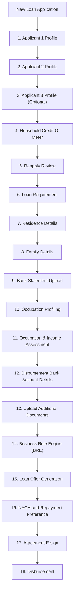

# New Loan Application - Super/Welcome Loan

Canonical for product intent, screen order, user-facing behavior, business rules, validations, acceptance criteria, and open questions for the Super/Welcome Loan new application flow.

Owner: Arnav  
Status: draft  
Last updated: 2026-06-29

## Source Links

| Source | Link/path | Notes |
| --- | --- | --- |
| In-app step screenshots | User-provided screenshots, 2026-06-11 | Canonical visible order for the current draft. |
| Workflow - Happy Flow | https://whimsical.com/inprime-los-v2-WGxkodoKa2e7AvUgWkL5Ng | Overall journey reference. |
| Workflow - Swim Lane | https://whimsical.com/inprime-workflow-swim-lane-UdDnvX3AS37G83UPTGaozJ | Role handoff reference. |
| Wireframes - Miro | https://miro.com/app/board/uXjVP29T3M4=/ | Screen/wireframe reference. |
| Wireframes - Figma | https://www.figma.com/file/F4TByjJMRTVNC8wFp8gNUq/InPrime-LOS?node-id=0-1&t=TAhXEvcdljhFjUVC-0 | Add exact frame links later. |
| Requirements attachment | User-provided attachment | Requirements, events, statuses, and logging notes. |
| Rough app documentation | Google Doc: https://docs.google.com/document/d/1RjWx3gUFbFS1ZXHuyM2ElMg1ltK7SCu__IaIKMfZocM/edit?usp=sharing | Detailed flow and screen behavior notes. |
| Flow doc | `../flows/new-loan-application-super-welcome.md` | End-to-end sequencing and handoffs. |

## Scope

This document covers only the **Super/Welcome Loan** path inside **New Loan Application**.

Out of scope:

- SMART Loan.
- Micro LAP.
- Top-Up Loan.
- All Loan Files / Case Queue.
- Provider-specific behavior.
- Detailed API implementation and code paths.

## Summary

The Super/Welcome Loan new application flow is an internal staff app journey used to create and complete a loan file through applicant profile capture, household eligibility, reapply review, loan requirement, residence and family details, bank statement upload, occupation and income assessment, disbursement account capture, additional document upload, BRE, offer generation, repayment setup, agreement e-sign, and disbursement tracking.

The current visible app order contains 18 steps. Product documentation should follow this order unless product/design confirms a newer flow.

## Business Objective

- Give staff a guided checklist for completing a Super/Welcome Loan application.
- Make each stage clear, trackable, and reviewable.
- Prevent progression when mandatory applicant, eligibility, document, income, bank, or repayment requirements are incomplete.
- Support optional Applicant 3 handling without confusing mandatory applicant completion.
- Reduce rework by capturing correct data and showing failure/review states at the right stage.
- Show final application progress from profile creation to disbursement status.

## Users And Roles

| Role | Product role in this flow | Open questions |
| --- | --- | --- |
| Relationship Officer (`RO`) | Starts the new loan application and completes work till Occupation Profiling; after credit offer generation, contacts customer and completes NACH/repayment preference, agreement e-sign, and send-for-disbursement steps. | Confirm any product-specific exception. |
| Applicant 1 / Primary Borrower | Main borrower whose profile drives the application. | Confirm exact age/eligibility wording. |
| Applicant 2 / Co-borrower | Mandatory first co-borrower profile captured after Applicant 1. | Applicant 2 age can be above 18. |
| Applicant 3 / Second Co-borrower | Completely optional co-borrower profile shown in the checklist. | Can be skipped without reason. |
| AM / PD | Owns Occupation & Income Assessment through BRE after RO completes Occupation Profiling. | Confirm any product-specific exception. |
| Credit / Review Team | Reviews eligibility, handles backend rework/approval, and generates final loan offer after review. | Tech/API status mapping belongs in tech docs. |
| Operations / Opex | Handles final disbursement after file is ready for disbursement. | Confirm retry ownership for failed disbursement. |

## Visual Journey

## Screen Inventory

| Step | Screen / module | In-app description | Product purpose | Expected outcome |
| --- | --- | --- | --- | --- |
| 1 | Applicant 1 Profile | Current Step - Provide Primary Borrower Profile Details | Create and complete the primary borrower profile. | Applicant 1 profile is created and marked complete when mandatory checks pass. |
| 2 | Applicant 2 Profile | Provide 1st Co-borrower Profile Details | Capture first co-borrower profile details. | Applicant 2 profile is completed or blocked until required details are provided. |
| 3 | Applicant 3 Profile (Optional) | Provide 2nd Co-borrower Profile Details | Capture second co-borrower only when applicable. | Applicant 3 is completed or skipped as optional. |
| 4 | Household Credit-O-Meter | View the Household Credit-O-Meter & basic eligibility | Show household-level credit/eligibility view. | Staff can understand whether the household can proceed, needs review, or is blocked. |
| 5 | Reapply Review | Review InPrime Past Applications | Check prior InPrime application history before continuing. | Prior application context is reviewed and any reapply rule is handled. |
| 6 | Loan Requirement | Fill out the loan requirement details | Capture requested loan requirement. | Loan requirement details are saved. |
| 7 | Residence Details | Provide Communication address & Resident Details | Capture applicant residence and communication address details. | Residence details are saved and validated. |
| 8 | Family Details | Provide Family Details of the Household | Capture household/family information. | Family details are saved. |
| 9 | Bank Statement Upload | Upload & Analyse bank statement for evaluating income | Upload and analyze bank statement for income assessment. | Bank statement is uploaded and analysis status is available. |
| 10 | Occupation Profiling | Please add a brief about the Major Occupations | Capture major occupations for the household/applicant. | Occupation profile summary is saved. |
| 11 | Occupation & Income Assessment | Add occupations of applicant and complete Income Assessment | AM/PD completes occupation-level income assessment after occupation profiling. | Income assessment is completed or marked pending/rework. |
| 12 | Disbursement Bank Account Details | Provide Primary Borrower Bank Account details for Loan Disbursement | AM/PD captures primary borrower account details as part of the assessment-to-BRE block. | Disbursement account details are saved and validated. |
| 13 | Upload Additional Documents | Provide any additional documents to support application | AM/PD uploads optional supporting documents if needed before BRE. | Step is completed or skipped; uploaded documents show status. |
| 14 | Business Rule Engine (BRE) | Check Business rule engine for the loan application | AM/PD runs or checks BRE after income assessment. | Application receives proceed/review/reject outcome. |
| 15 | Loan Offer Generation | View Final Loan Offer | Credit team generates the final loan offer after review/approval. | Final offer is visible and ready for RO customer follow-up. |
| 16 | NACH and Repayment Preference | Provide Repayment Preference & register on E-NACH | RO contacts customer and captures repayment preference / mandate setup. | Repayment preference and registration status are saved. |
| 17 | Agreement E-sign | View Loan Documents and complete E-Sign | RO coordinates customer e-sign for required loan documents. | Agreement signing is completed. |
| 18 | Disbursement | View Disbursement Status | Show final disbursement status. | Disbursement is pending, attempted, failed, or successful. |

## Detailed Product Flow

### 1. Applicant 1 Profile

1. Staff opens **Applicant 1 Profile** from the New Loan Application checklist.
2. Staff taps **Create Profile**.
3. Staff completes the hidden Applicant 1 substeps from the rough documentation.
4. Mandatory fields and validations must be completed before the step is marked complete.
5. Once completed, the checklist should allow progression to Applicant 2 Profile.

Hidden substeps to capture under Applicant 1 Profile:

| Substep | Product behavior |
| --- | --- |
| Mobile verification | OTP verification, WhatsApp validation, mobile de-dupe, and mobile submission. |
| Target Segment Checklist / Prime Test | Staff completes target segment checks. Failure can stop the journey. |
| Area Serviceability | Submitted pincode is checked against serviceable area list. Failure blocks progression. |
| Aadhaar validation | Aadhaar number/image is validated. Aadhaar must be 12-digit numeric. |
| Aadhaar data fetch/review | Aadhaar details are reviewed; Aadhaar becomes non-editable after proceed. Applicant 1 gender validation applies as per rough doc. |
| Additional documents | Staff may add supporting KYC documents such as PAN, Voter ID, DL, or other accepted documents. |
| Profile image | Staff captures profile image; face match/liveness failure or override should be recorded where applicable. |
| Profile verification / bureau check | Applicant 1 profile is verified and credit bureau/profile BRE stage is completed. |

Confirmed product notes:

- Applicant 1 age rule differs from Applicant 2; Applicant 1 should follow the stricter primary borrower eligibility from the rough doc.
- Hidden steps should follow the rough documentation even though the app checklist shows only the high-level Applicant 1 Profile step.

Open item to confirm:

- Exact Applicant 1 field list and age rule wording.

### 2. Applicant 2 Profile

1. Staff opens **Applicant 2 Profile**.
2. Staff captures first co-borrower details.
3. Applicant 2 is mandatory for every Super/Welcome Loan application.
4. Applicant 2 age can be above 18, unlike Applicant 1 where the primary borrower age rule is stricter.
5. Required validations must pass before completion.
6. The system should keep the application blocked if Applicant 2 is incomplete.

Hidden substeps to capture under Applicant 2 Profile:

| Substep | Product behavior |
| --- | --- |
| Mobile/profile initiation | Applicant 2 profile is initiated and required contact/profile details are captured. |
| Aadhaar validation | Aadhaar validation follows the rough documentation pattern. |
| Aadhaar data fetch/review | Aadhaar data is reviewed and locked after proceed. |
| Additional documents | Supporting documents can be added and verified. |
| Profile image | Profile image is captured and verified. |
| Profile verification / bureau check | Applicant 2 profile verification and credit bureau/profile BRE stage are completed. |

### 3. Applicant 3 Profile (Optional)

1. Staff opens **Applicant 3 Profile (Optional)** when a second co-borrower is applicable.
2. Applicant 3 is completely optional.
3. If Applicant 3 is not required, staff can use the skip option.
4. No skip reason is required.
5. If Applicant 3 is added, mandatory profile checks should be completed before marking it complete.

Hidden substeps, only when Applicant 3 is added:

| Substep | Product behavior |
| --- | --- |
| Mobile/profile initiation | Same pattern as Applicant 2. |
| Aadhaar validation and review | Same pattern as Applicant 2. |
| Additional documents | Same pattern as Applicant 2. |
| Profile image and verification | Same pattern as Applicant 2. |

Confirmed product notes:

- Applicant 3 skip must not block progression.
- Applicant 3 skip does not require any reason.

### 4. Household Credit-O-Meter

1. Staff views household-level credit and basic eligibility after applicant profiles.
2. The screen summarizes eligibility using household credit indicators and applicant score bands.
3. If score is below the configured cutoff level, this step can reject or block the application.
4. If eligible, staff can continue using **Apply Now**.

Visible result labels from screenshot:

| Label | Meaning |
| --- | --- |
| Total Amount of Loans Taken | Total existing/past loan amount considered for the household/applicant view. |
| Peak EMI Paid in a month | Highest monthly EMI observed. |
| Highest Loan Amount Received | Highest prior loan amount received. |
| Current Unpaid Overdue Amount | Current overdue amount. |
| Current Monthly Obligation | Current monthly obligation; screen may expose a **View** action. |
| Written-off amount | Current written-off amount. |
| Digitally Active | Digital activity indicator, shown with smartphone count. |
| Applicant score and band | Applicant-wise score such as `721 | Good`. |
| Eligibility message | Example: `You are Eligible for InPrime Loan`. |

Open item to confirm:

- Exact score cutoff level below which application is rejected or blocked.

### 5. Reapply Review

1. Staff reviews the applicant or household's past InPrime applications.
2. The screen shows rejected or expired past applications identified using mobile number.
3. If the applicant is fresh and no rejected/expired application is found, Reapply Review can be skipped.
4. Any block, warning, or allowed continuation should be clearly shown.

Confirmed product notes:

- Past applications shown: rejected or expired applications.
- Matching rule: mobile number identifies rejected or expired applications.
- Fresh applicants can skip Reapply Review.

Open item to confirm:

- Whether staff can override a reapply warning.

### 6. Loan Requirement

1. Staff enters requested loan requirement details.
2. Required fields include amount, tenure, purpose, and any other product-required values.
3. Required loan fields should be validated before submission.
4. The step is marked complete after successful submission.

Confirmed product limits:

| Product | Amount limit |
| --- | --- |
| Super Loan | Rs. 80,000 to Rs. 3 lakh |
| Welcome Loan | Rs. 80,000 to Rs. 1.5 lakh |

Confirmed product note:

- Super Loan and Welcome Loan use the same flow; only range/limit differs.

### 7. Residence Details

1. Staff enters communication address and residence details.
2. Address and pincode/serviceability validations should run where applicable.
3. Geolocation and residence photo are mandatory.
4. Residence data is saved after mandatory fields pass.

Confirmed product note:

- Current residence and communication address can differ.

### 8. Family Details

1. Staff captures household and family information when available.
2. Family member fields are optional.
3. Dependents, earners, and obligations are optional in this section.
4. Family details may support household eligibility and income assessment when entered.

### 9. Bank Statement Upload

1. Staff uploads bank statement for income evaluation.
2. Minimum required statement period is 6 months.
3. Accepted sources/formats include PDF, account aggregator, e-PDF, net banking, and passbook.
4. Manual entry is allowed when upload fails.
5. The app should show upload success, failure, and analysis status.

### 10. Occupation Profiling

1. Staff adds a brief about major occupations.
2. Approved occupation categories are available in the app.
3. Occupation can be captured per applicant and/or household as applicable.
4. Occupation profiling should support the next income assessment step.

### 11. Occupation & Income Assessment

1. AM/PD person adds applicant occupations and completes income assessment.
2. The app validates required income details.
3. RO does not own this assessment step.
4. AM/PD owns this section for assessment and review.
5. The assessment result should determine whether the file can continue, needs rework, or needs review.

Open items to confirm:

- Exact income assessment fields.
- Whether income assessment has configurable cutoff rules.

### 12. Disbursement Bank Account Details

1. AM/PD enters bank account details for loan disbursement as part of the assessment-to-BRE block.
2. Required fields should include account holder name, account number, IFSC, and bank details if applicable.
3. Account name matching is mandatory.
4. Account does not have to belong only to Applicant 1.
5. The app should validate required fields and show mismatch/retry states where applicable.

### 13. Upload Additional Documents

1. AM/PD uploads any additional documents required to support the application before BRE.
2. No document is mandatory in this step by default.
3. The step can be skipped.
4. If documents are uploaded, the screen should show uploaded, failed, or pending states.

### 14. Business Rule Engine (BRE)

1. AM/PD checks or runs BRE for the loan application after Occupation & Income Assessment is complete.
2. BRE result should decide whether the application can move to offer, review/rework, or rejection.
3. Product-visible result should be understandable and actionable.

Open items to confirm:

- Exact result labels: Green/Yellow/Red or another naming.
- Which failures are hard stops vs reviewable.

### 15. Loan Offer Generation

1. Credit team generates the final loan offer after review/approval.
2. RO views the final loan offer and contacts the customer for confirmation.
3. Offer should show customer-relevant values needed for confirmation.
4. RO submits or records customer acceptance according to product rules.
5. Loan offer expires 7 days after generation.

Open items to confirm:

- Offer fields shown in detail from the rough doc.
- Whether customer can choose between multiple offers.

### 16. NACH and Repayment Preference

1. RO captures repayment preference after contacting the customer.
2. RO/customer completes E-NACH registration where required.
3. App shows registration pending, failed, or completed state.

Open items to confirm:

- Allowed repayment modes.
- Retry behavior for failed registration.

### 17. Agreement E-sign

1. RO opens loan documents with the customer.
2. Loan documents are generated before repayment registration.
3. Both applicants must complete e-sign.
4. App shows signing status and blocks disbursement until signing is complete.

### 18. Disbursement

1. Staff views disbursement status.
2. App shows pending, attempted, failed, or successful disbursement state.
3. Disbursement is triggered by the operations team / Opex.
4. Failed disbursement should expose next action or escalation route.

Open item to confirm:

- Whether staff can retry failed disbursement or only operations can act.

## Business Rules And Validations

| Area | Product rule / validation | Status |
| --- | --- | --- |
| Step order | The visible application checklist follows the 18-step order in this document. | Confirmed from screenshot, needs stakeholder validation. |
| Applicant 1 | Primary borrower profile must be completed before the rest of the flow can proceed. | Needs field confirmation. |
| Applicant 2 | Applicant 2 is mandatory; age can be above 18. | Confirm exact age validation copy. |
| Applicant 3 | Applicant 3 is completely optional and can be skipped without reason. | Confirmed by Arnav. |
| Household eligibility | Household Credit-O-Meter should summarize basic eligibility before loan requirement; application can reject/block if score is below cutoff. | Confirm cutoff level. |
| Reapply | Rejected or expired applications are shown using mobile number matching; fresh applicants can skip. | Confirm override behavior. |
| Loan requirement | Amount, tenure, purpose, and other required values must be captured; latest product-limit screenshot says Super Loan is Rs. 80,000 to Rs. 3 lakh and Welcome Loan is Rs. 80,000 to Rs. 1.5 lakh. | Confirm tenure/FOIR/EMI rules. |
| Residence | Communication address and resident details must pass required validations; geolocation and residence photo are mandatory; current residence and communication address can differ. | Validated by Arnav. |
| Family | Family member fields, dependents, earners, and obligations are optional. | Confirm whether any later rule consumes optional data. |
| Bank statement | Minimum 6 months required; accepted sources/formats include PDF, account aggregator, e-PDF, net banking, and passbook; manual entry is allowed if upload fails. | Confirm exact UI labels for each source. |
| Occupation and income | Occupation categories exist; occupation can be captured per applicant/household; RO completes Occupation Profiling, while AM/PD owns Occupation & Income Assessment through BRE. | Confirm exact income fields and cutoff rules. |
| Disbursement account | Account name matching is mandatory; account does not have to belong only to Applicant 1. | Confirm allowed account holder rules. |
| Additional documents | No documents are mandatory by default; this step can be skipped. | Confirm if BRE/rework can later request documents. |
| BRE | BRE outcome determines offer, review/rework, or rejection path. | Confirm exact outcomes. |
| Offer | Final offer must be generated before repayment preference and e-sign; offer expires 7 days after generation. | Confirm acceptance rules and detailed offer fields. |
| Repayment | Repayment preference/E-NACH must complete before final disbursement. | Confirm retry/failure behavior. |
| Agreement | Documents are generated before repayment registration; both applicants must complete e-sign. | Confirm if Applicant 3 signs when added. |
| Disbursement | Disbursement is triggered by operations team / Opex and screen must show final status clearly. | Confirm retry ownership. |

## Key Application Statuses To Confirm

| Step | Candidate status/event | Product meaning |
| --- | --- | --- |
| 1 | `Applicant1ProfileCompleted` / `App1CBChecked` | Applicant 1 profile completed. |
| 2 | `Applicant2ProfileCompleted` / `App2CBChecked` | Applicant 2 profile completed. |
| 3 | `Applicant3Skipped` / `Applicant3ProfileCompleted` | Optional applicant skipped or completed. |
| 4 | `HHCreditMeterGenerated` | Household Credit-O-Meter generated. |
| 5 | `ReapplyReviewCompleted` | Past application review completed. |
| 6 | `LoanReqSubmitted` | Loan requirement submitted. |
| 7 | `ResidenceDetailsSubmitted` | Residence details submitted. |
| 8 | `FamilyDetailsSubmitted` | Family details submitted. |
| 9 | `BankStatementUploaded` / `BankStatementAnalysed` | Bank statement uploaded and analysis completed. |
| 10 | `OccupationProfilingSubmitted` | Occupation profile submitted. |
| 11 | `OccupationIncomeAssessmentCompleted` / `OccupationBRERunCompleted` | Income assessment completed. |
| 12 | `DisbBankAccAdded` | Disbursement bank account details added. |
| 13 | `AdditionalDocumentsUploaded` / `AdditionalDocumentsSkipped` | Supporting documents uploaded or optional step skipped. |
| 14 | `MainBRERunCompleted` | BRE completed. |
| 15 | `ApplicationFinalOfferGenerated` / `ApplicationFinalOfferSubmitted` | Final offer generated/submitted. |
| 16 | `RepayModeSubmitted` / `RepaymentRegistrationCompleted` | Repayment preference and registration completed. |
| 17 | `LoanAgreementSigned` | Agreement e-sign completed. |
| 18 | `DisbursementAttempted` / `DisbursementFailed` / `DisbursementSuccess` | Disbursement lifecycle state. |

## Acceptance Criteria

- Staff can open New Loan Application and see the Super/Welcome Loan checklist in the 18-step order listed here.
- Step 1 is shown as **Applicant 1 Profile** with **Create Profile** action when not started.
- Applicant 3 is clearly marked optional.
- Applicant 3 can be skipped without asking for a reason.
- Completed, pending, locked, failed, skipped, and rework states are visually clear on the checklist.
- Staff cannot complete a mandatory step without required fields.
- Staff cannot progress past mandatory applicant/profile steps if required applicant data is incomplete.
- Household Credit-O-Meter appears before Reapply Review and Loan Requirement.
- Reapply Review appears before Loan Requirement.
- Bank Statement Upload appears before Occupation Profiling and Occupation & Income Assessment.
- Bank Statement Upload accepts at least 6 months of statement through PDF, account aggregator, e-PDF, net banking, or passbook, with manual entry allowed if upload fails.
- BRE appears after additional documents and before credit-generated final offer.
- Credit team generates the loan offer after BRE/review approval.
- RO contacts the customer after offer generation for NACH/Repayment Preference, agreement e-sign, and disbursement follow-up.
- Upload Additional Documents can be skipped when no extra document is required.
- Loan documents are generated before repayment registration.
- Applicant 1 and Applicant 2 must complete Agreement E-sign.
- Agreement E-sign appears before Disbursement.
- Disbursement is triggered by operations team / Opex.
- Disbursement screen shows clear final status.
- Any unknown, failed, or review-required condition gives staff a clear next action.

## Mismatches Or Contradictions

| Issue | Impact | Status |
| --- | --- | --- |
| Earlier rough docs included more granular hidden steps like mobile verification, Aadhaar, serviceability, and document verification. Screenshots show a higher-level 18-step checklist. | Product docs use visible 18-step order, and hidden substeps are documented under the relevant high-level checklist step using the rough doc. | Updated |
| Applicant 3 is visibly optional, and skip requires no reason. | Product completion logic should allow skip without blocking. | Updated |
| Reapply Review appears in screenshot but was missing or less visible in earlier draft. | Must be included in current product and flow docs. | Updated |
| Bank Statement Upload appears before Occupation Profiling in screenshot. Earlier draft placed bank/income differently. | Screen order corrected to screenshot order. | Updated |

## Open Questions

| Question | Owner | Needed from | Status |
| --- | --- | --- | --- |
| What is the exact Applicant 1 age/eligibility wording? | Arnav | Product/credit | Open |
| What are the exact field names inside Applicant 1, Applicant 2, and Applicant 3 Profile? | Arnav | Product/design | Open |
| What is the exact Household Credit-O-Meter cutoff level below which the application is rejected or blocked? | Arnav | Product/credit | Open: varies/flexible; needs credit confirmation. |
| Can staff override a Reapply Review warning? | Arnav | Product/operations | Open |
| What are the exact Super/Welcome tenure, FOIR, and EMI rules? | Arnav | Product/credit | Open |
| Can BRE/rework make additional documents mandatory later even though the base Additional Documents step can be skipped? | Arnav | Product/compliance | Open |
| What are the exact BRE outcomes and what path does each outcome trigger? | Arnav | Product/credit | Open |
| If Applicant 3 is added, does Applicant 3 also need to complete Agreement E-sign? | Arnav | Product/legal/operations | Open |
| Who can retry or resolve failed disbursement after Opex triggers it? | Arnav | Product/operations | Open |
