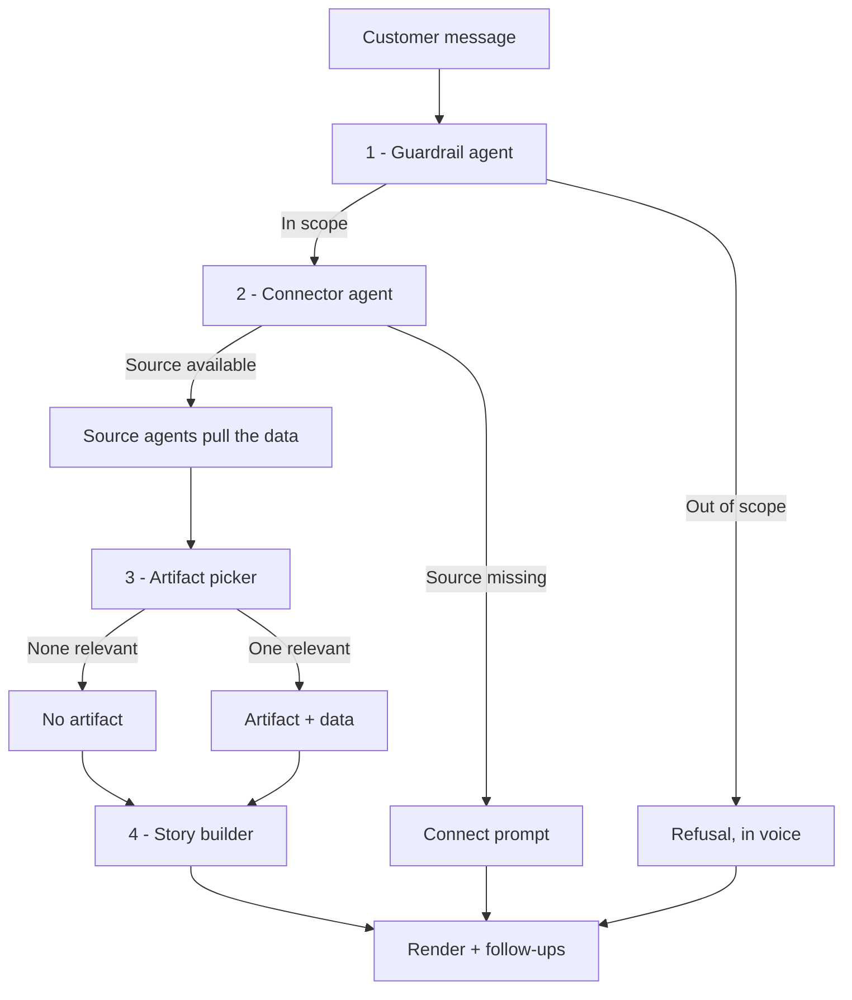

# master.md

> Compiled from the Grounding Document v5, the meeting log 25 Aug – 10 Sep, and the 12 Sep artifact
> catalogue (77 artifacts, supersedes the 44-item Notion "Artifacts" page). **Owner: Engineering.**
> Per Siddharth, 10 Sep: *"not one system prompt — a master file that dispatches agents, one
> instruction file per agent, plus an admin-configurable layer above the system prompt."*

## What this system is

An agent assisting Indian shopkeepers with their finances — income, loans, understanding their
industry, and increasing what they earn. It answers in a chat thread: one or two lines of text,
sometimes one visual artifact below it.

## Agents, in order

| # | Agent | File | Input | Output |
|---|---|---|---|---|
| 1 | Guardrail | `guardrail.md` | Customer message | In scope, or a refusal |
| 2 | Connector | `connector.md` | Intent | Named sources, or a connect prompt |
| 3 | Source agents | `sources.md` | Named source | Data values |
| 4 | Artifact picker | `artifact-picker.md` | Intent + available data | One artifact name, or none |
| 5 | Story builder | `story.md` | Everything above | Text + follow-ups |

Any agent may stop the chain. None of the following is a failure state — each is a normal,
designed outcome with its own copy:

- The guardrail refuses (out of scope)
- The connector finds nothing connected (connect prompt)
- The picker finds nothing relevant (text only, no artifact)

## Rules that bind every agent

1. **No agent states a number.** Source agents return values. Code renders them into the artifact
   using the data contract. Text never contains a figure the story builder composed itself.
2. **No agent invents an artifact.** The picker chooses from the fixed list in `artifact-picker.md`
   or returns none. Two artifacts, only where a pairing is listed. Never more than two.
3. **No agent guesses.** Below the confidence floor, the answer is a person, not an estimate.
4. **Any agent may stop the chain** — see above.
5. Every response ends with two or three follow-up questions, generated fresh, never a fixed menu.
6. **Artifacts are use-case specific, not generic containers.** One artifact, one question shape,
   fixed labels. Decided 8 Sep. A shared visual shape that recurs across artifacts is a *pattern*
   (see `artifact-picker.md` → Components), and the picker never selects a pattern directly.
7. **Only the EMI calculator (A-28) is interactive.** Every other artifact is display-only.

## Handoff contract

Each agent returns a structured object, not prose:

```
Guardrail  → { in_scope: bool, reason, refusal_text }
Connector  → { sources: [], missing: [], connect_prompt }
Source     → { values: {}, gaps: [] }
Picker     → { artifact: name | null, why }
Story      → { text, follow_ups: [] }
```

## The file map

| File | Job | Editable by |
|---|---|---|
| `master.md` | Dispatches the agents. Holds the rules that bind all of them | Engineering |
| `guardrail.md` | Is this in scope. Refuses, or passes it on | Admin |
| `connector.md` | Names the data needed. Checks what is available | Admin |
| `sources.md` | What each data source holds and cannot answer | Engineering |
| `artifact-picker.md` | Chooses one artifact, or none | Admin |
| `story.md` | Writes the text around the artifact *(not drafted in this pass)* | Admin |
| `voice.md` | Shared tone rules, loaded by guardrail and story *(not drafted in this pass)* | Admin |
| `intent-set.md` | 71 intents with phrasings and scope, read by guardrail and picker | Admin |
| `artifacts.md` | The 77-artifact catalogue, read by the picker | Admin |
| `copy-deck.md` | Fixed strings in three languages, read by guardrail and story | Admin + compliance |
| `data-contracts.md` | Fields, types, missing-field behaviour, read by the renderer | Engineering |

**Admin-editable** means product or ops can change it in the application without a release.
**Engineering** means it changes with code.

## Day-0 versus later

Per the 27 Aug decision, not every source is available from the first session. **Day-0 connectors:
SMS, Credit bureau, Account Aggregator.** QR settlement, DigiLocker and the season calendar connect
later, when the relevant intent first comes up. `connector.md` must not assume a source is present
just because it is listed — it checks, every time.

## Open item this file does not resolve

**Subscription gating.** The 25 Aug and 27 Aug logs describe a freemium model — a free tier with a
basic loan connector, and a paid tier (₹99, figure as discussed then) unlocking the full assistant
and additional connectors including the credit bureau. Nothing in the current agent chain checks
subscription tier before naming or fetching a source. Until this is resolved, treat every source in
`sources.md` as available to every customer. **This needs a product decision before launch**, and a
short addition to `connector.md` once decided.

## Pipeline



## Change log

| Date | What changed |
|---|---|
| 25–27 Aug | Chat-first pivot. Freemium model. Day-0 connectors named: SMS, Bureau, AA |
| 29 Aug – 8 Sep | Onboarding flow locked. Artifact principle set: simplicity-first, use-case specific |
| 10 Sep | Multi-agent architecture decided — this file map |
| 12 Sep | Reconciled against the 77-artifact catalogue and this instruction set drafted |
